# Quid faciam Hodie

## What did I do today?

Find out what you did all the days and unlock moments you completely forgot!

## Showcase

### Available for Android

    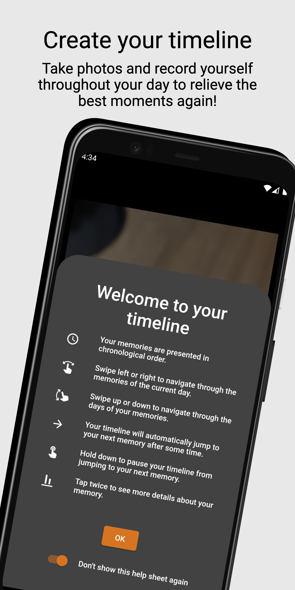
    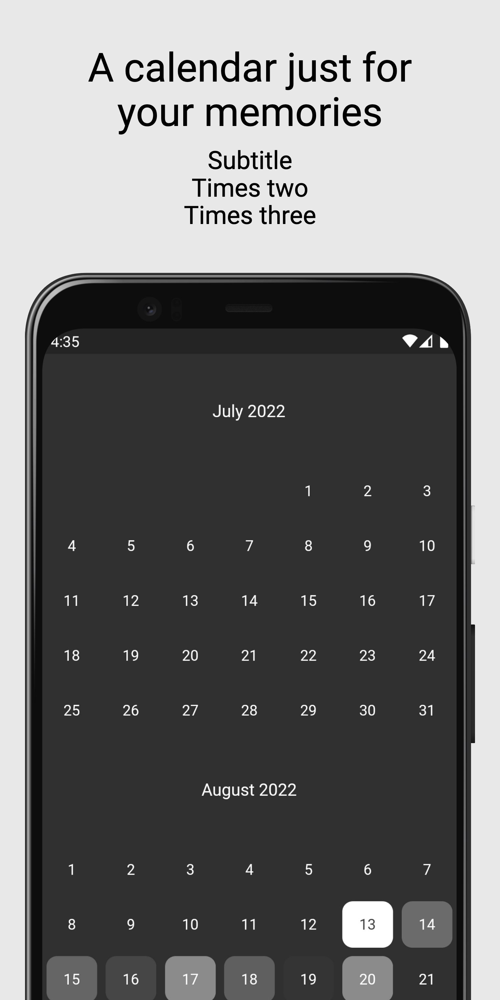
    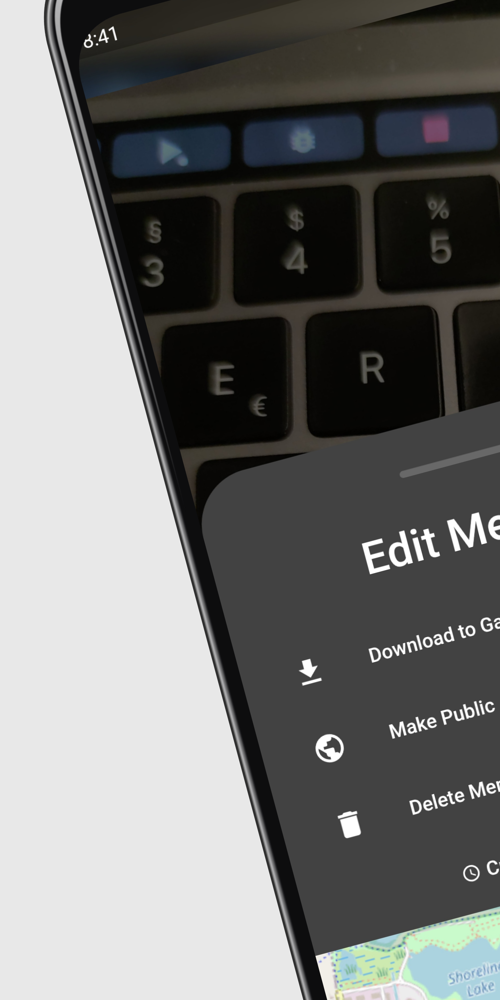
    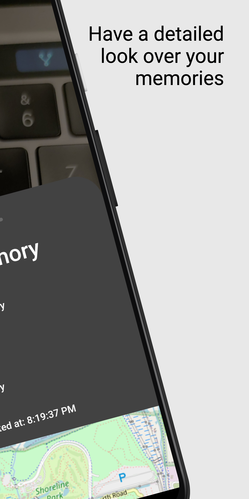
    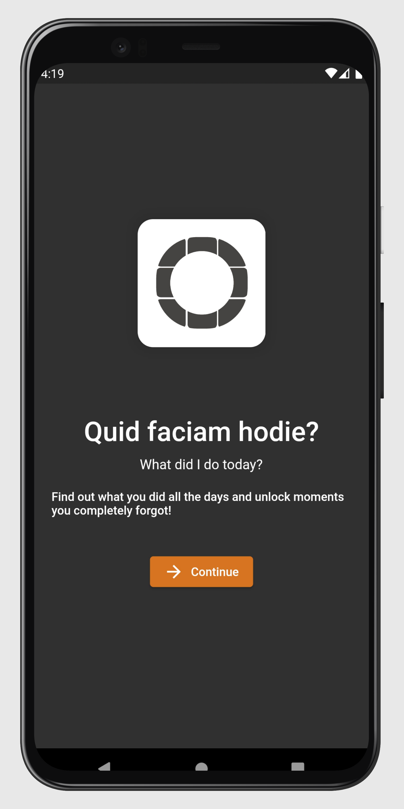
    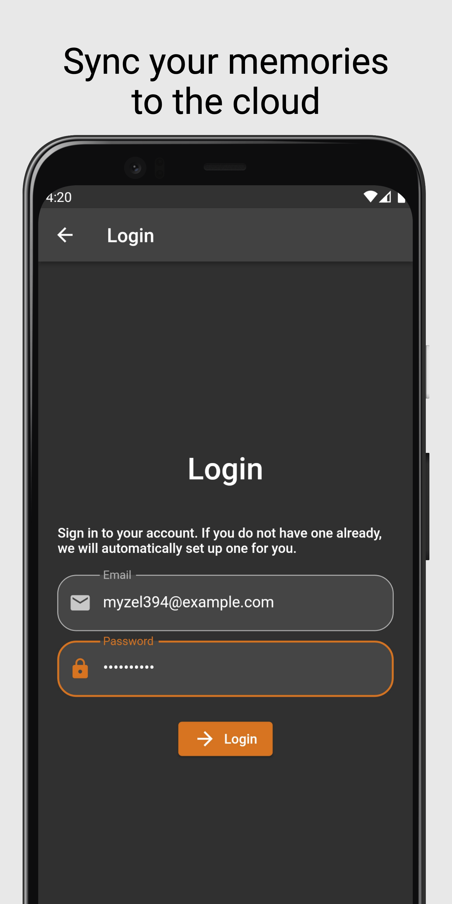

### As well as for iOS!

    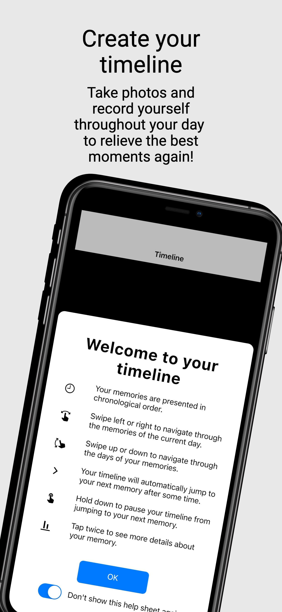
    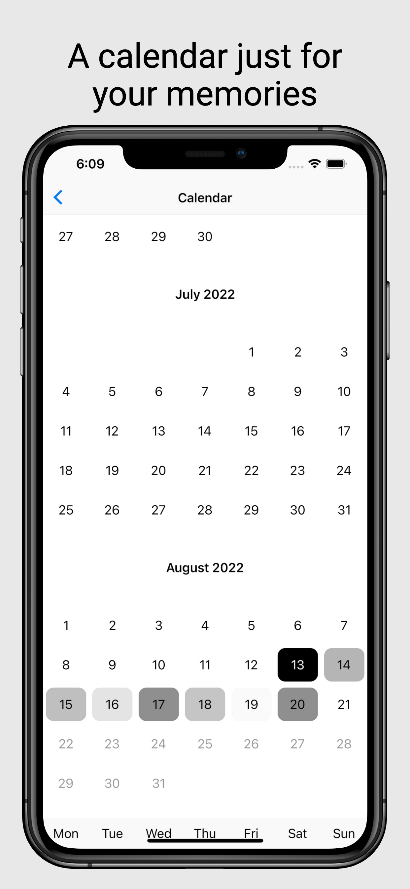
    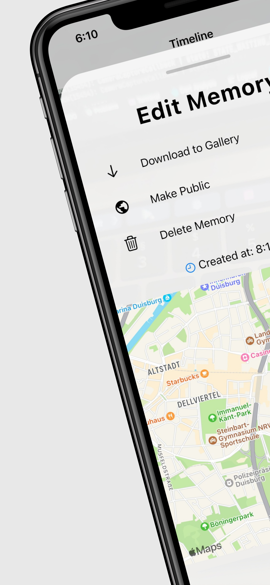
    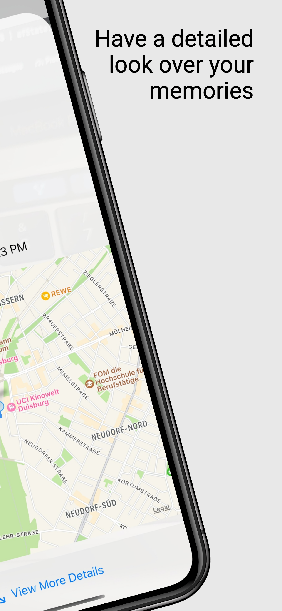
    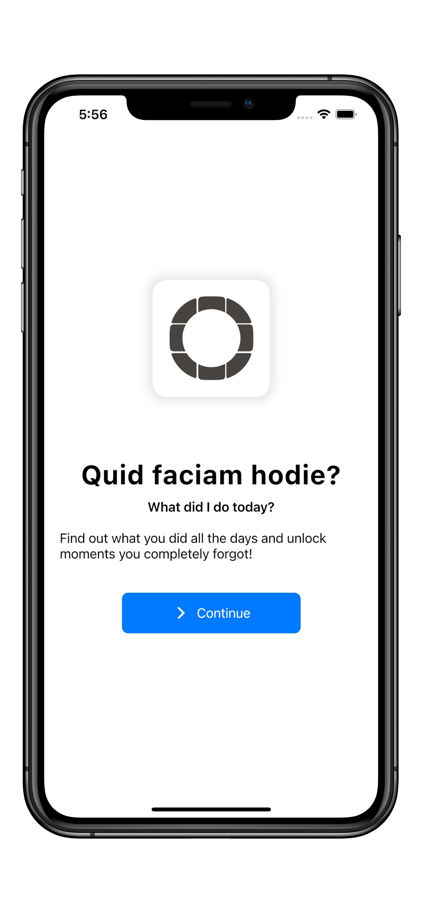

## App checkup

* :heart: Created using Flutter
* :apple: Native behavior on Android & iOS
* :white_check_mark: Tested on multiple real devices
* :u7a7a: Completely localized (available in English & German)
* :flashlight: Usage of Supabase's Auth, Database, Storage & Realtime functionality
* :new_moon_with_face: Supports dark mode
* :fast_forward: Optimized for efficient behavior

## Quick start

### Create an account / log in

Go through the welcome screen and log in with your email and password.
If you don't have an account already, we will automatically create one for you.

### Create a new memory

Press on the shutter button once to create a photo.
Hold it down to create a video.

### View your memories

Tap on the bottom right image / movie to view your timeline.
You can swipe to see all your memories from here.
